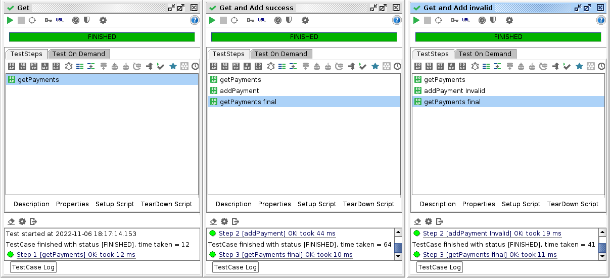

# HW4 - Web Service Composition

V souboru `pom.xml` jsem pomoci pluginu `maven-jaxb2-plugin` vygeneroval tridy pro validaci informaci o kreditni karte.Definoval jsem WSDL v `src/main/resources/payments.xsd`.

V `src/main/java/cz/cvit/fit/niam1/wsserver` jsem postupoval podle teplatu z cviceni.

Export nastaveni z SoapUI je ve slozce `results`.
V teto slozce se nachazi i screenshoty z testovani.

### Vypis plateb:

___
### Uspesne pridani:

___
### Neuspesne pridani:

___
### Testy:
